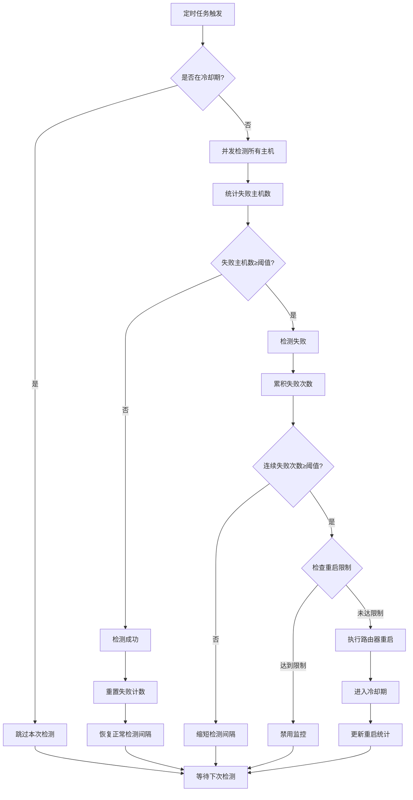

# 网络监控功能文档

## 概述

网络监控功能是一个基于定时任务的智能网络连通性检测系统，专门为运行在 OpenWrt 路由器上的应用程序设计。当检测到网络连通性问题时，系统会自动重启路由器以恢复网络连接。

## 核心特性

### 🎯 智能检测算法
- **多主机并发检测**：同时检测多个目标主机，提高检测准确性
- **双重验证机制**：TCP连接 + PING命令双重验证，确保检测可靠性
- **失败累积算法**：连续多次失败才触发重启，避免误判

### ⚡ 动态调度机制
- **正常检测间隔**：网络正常时使用较长间隔（默认5分钟）
- **失败检测间隔**：检测到问题时缩短间隔（默认1分钟）
- **自动频率调整**：根据网络状态动态切换检测频率

### 🛡️ 多重保护机制
- **重启次数限制**：时间窗口内最大重启次数保护
- **冷却期机制**：重启后强制冷却期，避免频繁重启
- **优雅关闭**：程序退出时正确停止所有定时任务

## 技术架构

### 基础架构
```
┌─────────────────┐    ┌─────────────────┐    ┌─────────────────┐
│   API Layer     │    │  Service Layer  │    │   Biz Layer     │
│                 │    │                 │    │                 │
│ - 状态查询      │───▶│ - 配置验证      │───▶│ - 定时任务管理  │
│ - 控制操作      │    │ - 生命周期管理  │    │ - 网络检测逻辑  │
│ - 参数验证      │    │ - 错误处理      │    │ - 重启决策      │
└─────────────────┘    └─────────────────┘    └─────────────────┘
                                                        │
                       ┌─────────────────┐             │
                       │   DAO Layer     │◀────────────┘
                       │                 │
                       │ - 状态持久化    │
                       │ - 统计数据      │
                       │ - 重启日志      │
                       └─────────────────┘
```

### 定时任务调度
```
程序启动 ──▶ 初始化gocron调度器 ──▶ 创建网络检测任务 ──▶ 开始定时检测
    │                                      │
    │                                      ▼
    └─ 配置自动启动 ──▶ 根据配置决定是否启动    定时执行检测逻辑
```

## 检测逻辑详解

### 检测流程


### 主机检测算法
```go
func (b *Monitor) pingHost(host string) vmodel.HostCheckResult {
    // 1. 先尝试TCP连接（端口80）
    conn, err := net.DialTimeout("tcp", net.JoinHostPort(host, "80"), timeout)
    if err == nil {
        conn.Close()
        return success  // TCP连接成功
    }
    
    // 2. TCP失败，尝试PING命令
    pingCmd := fmt.Sprintf("ping -c 1 -W %d %s", timeout, host)
    if _, pingErr := utils.RunBashCtx(ctx, pingCmd); pingErr == nil {
        return success  // PING成功
    }
    
    return failure  // 两种方式都失败
}
```

## 配置说明

### 配置文件示例
```toml
[NetworkMonitor]
# 基本设置
Enable = true                    # 是否启用网络监控
CheckInterval = 300             # 正常检测间隔（秒）
FailCheckInterval = 60          # 失败后检测间隔（秒）
CheckTimeout = 10               # 单次检测超时（秒）

# 检测目标
TestHosts = [                   # 测试主机列表
    "8.8.8.8",
    "114.114.114.114", 
    "1.1.1.1",
    "223.5.5.5",
    "www.baidu.com"
]

# 失败判定
FailThreshold = 3               # 连续失败阈值（次）
FailHostThreshold = 3           # 单次检测失败主机数阈值

# 重启保护
MaxRestarts = 5                 # 最大重启次数
RestartWindow = 24              # 重启计数窗口期（小时）
CooldownPeriod = 30             # 重启后冷却期（分钟）
```

### 配置参数详解

| 参数 | 类型 | 默认值 | 说明 |
|------|------|--------|------|
| `Enable` | bool | false | 是否启用网络监控功能 |
| `CheckInterval` | int | 300 | 正常状态下的检测间隔（秒） |
| `FailCheckInterval` | int | 60 | 检测失败后的检测间隔（秒） |
| `CheckTimeout` | int | 10 | 单次主机检测的超时时间（秒） |
| `TestHosts` | []string | 见上 | 用于检测的目标主机列表 |
| `FailThreshold` | int | 3 | 触发重启的连续失败次数 |
| `FailHostThreshold` | int | 3 | 单次检测中失败主机数阈值 |
| `MaxRestarts` | int | 5 | 时间窗口内最大重启次数 |
| `RestartWindow` | int | 24 | 重启次数统计的时间窗口（小时） |
| `CooldownPeriod` | int | 30 | 重启后的冷却期（分钟） |

## API 接口

### 获取监控状态
```http
GET /router/monitor
```

**响应示例：**
```json
{
  "code": 0,
  "message": "success",
  "data": {
    "status": {
      "enabled": true,
      "current_status": "running",
      "last_check_time": "2025-08-13T17:00:00Z",
      "next_check_time": "2025-08-13T17:05:00Z",
      "consecutive_fails": 0,
      "total_restarts": 2,
      "restarts_in_window": 1,
      "last_restart_time": "2025-08-13T16:30:00Z",
      "last_check_results": [
        {
          "host": "8.8.8.8",
          "success": true,
          "latency": 50000000,
          "check_time": "2025-08-13T17:00:00Z"
        }
      ],
      "config": {
        "enable": true,
        "check_interval": 300,
        "fail_check_interval": 60,
        "test_hosts": ["8.8.8.8", "114.114.114.114"]
      }
    },
    "stats": {
      "total_checks": 120,
      "successful_checks": 118,
      "failed_checks": 2,
      "success_rate": 98.33,
      "average_latency": 45000000
    }
  }
}
```

### 控制监控操作
```http
POST /router/monitor
Content-Type: application/json
```

**请求参数：**
```json
{
  "action": "start|stop|restart|reset|update_config",
  "config": {
    // 配置参数（仅在start和update_config时需要）
  }
}
```

**支持的操作：**
- `start`: 启动网络监控
- `stop`: 停止网络监控
- `restart`: 重启网络监控
- `reset`: 重置监控状态和统计
- `update_config`: 更新配置

## 使用示例

### 1. 启用自动监控
编辑配置文件 `backend/config/config.toml`：
```toml
[NetworkMonitor]
Enable = true
CheckInterval = 300
TestHosts = ["8.8.8.8", "114.114.114.114", "1.1.1.1"]
```

重启程序，监控将自动启动。

### 2. 手动控制监控

**启动监控：**
```bash
curl -X POST http://localhost:8080/router/monitor \
  -H "Content-Type: application/json" \
  -d '{
    "action": "start",
    "config": {
      "enable": true,
      "check_interval": 180,
      "test_hosts": ["8.8.8.8", "114.114.114.114"]
    }
  }'
```

**查看状态：**
```bash
curl http://localhost:8080/router/monitor
```

**停止监控：**
```bash
curl -X POST http://localhost:8080/router/monitor \
  -H "Content-Type: application/json" \
  -d '{"action": "stop"}'
```

### 3. 监控日志示例
```
[INFO]: 网络监控定时任务已启动，检测间隔: 5m0s
[DEBUG]: 开始执行网络连通性检测
[ERROR]: 网络检测失败，连续失败次数: 1/3，失败主机: 2/3
[ERROR]: 网络检测失败，连续失败次数: 2/3，失败主机: 3/3
[ERROR]: 网络连通性持续异常，执行路由器重启
[INFO]: 路由器重启命令已执行
[INFO]: 网络连通性恢复正常
```

## 状态说明

### 监控状态
- `running`: 正常运行中
- `cooldown`: 重启后冷却期
- `disabled`: 已禁用（手动或达到重启限制）
- `error`: 发生错误

### 检测结果
每次检测都会记录所有主机的检测结果，包括：
- 主机地址
- 检测是否成功
- 响应延迟
- 错误信息（如果失败）
- 检测时间

## 故障排查

### 常见问题

**1. 监控未自动启动**
- 检查配置文件中 `Enable` 是否为 `true`
- 查看程序启动日志是否有错误信息

**2. 频繁重启路由器**
- 检查 `FailThreshold` 和 `FailHostThreshold` 设置是否过于敏感
- 增加 `CooldownPeriod` 时间
- 检查测试主机列表是否合适

**3. 监控停止工作**
- 可能达到了最大重启次数限制
- 使用 `reset` 操作重置状态
- 检查系统时间是否正确

**4. 检测结果不准确**
- 调整 `CheckTimeout` 超时时间
- 更换测试主机列表
- 检查网络环境是否稳定

### 调试技巧

**查看详细状态：**
```bash
curl http://localhost:8080/router/monitor | jq .
```

**重置监控状态：**
```bash
curl -X POST http://localhost:8080/router/monitor \
  -H "Content-Type: application/json" \
  -d '{"action": "reset"}'
```

**调整配置：**
```bash
curl -X POST http://localhost:8080/router/monitor \
  -H "Content-Type: application/json" \
  -d '{
    "action": "update_config",
    "config": {
      "check_interval": 120,
      "fail_threshold": 5
    }
  }'
```

## 最佳实践

### 配置建议
1. **测试主机选择**：选择稳定、响应快的公共DNS或知名网站
2. **检测间隔**：正常间隔不宜过短（建议≥3分钟），失败间隔可适当缩短
3. **失败阈值**：设置合理的失败阈值，避免网络抖动导致误重启
4. **重启限制**：设置合理的重启次数限制，防止无限重启

### 部署建议
1. **测试环境**：先在测试环境验证配置的合理性
2. **监控日志**：关注程序日志，及时发现异常
3. **定期检查**：定期查看监控状态和统计信息
4. **备份配置**：保存好经过验证的配置文件

## 技术细节

### 依赖库
- `github.com/go-co-op/gocron/v2`: 定时任务调度
- `github.com/leafney/rose-leveldb`: 数据持久化
- `github.com/gofiber/fiber/v2`: HTTP API框架

### 数据存储
- 监控状态存储在 LevelDB 中，程序重启后可恢复
- 统计数据持久化保存
- 重启日志按日期分组存储

### 性能考虑
- 并发检测多个主机，提高检测效率
- 使用连接池和超时控制，避免资源泄露
- 智能调度减少不必要的检测，节省系统资源

---

更多技术细节和源码分析，请参考项目源码中的相关注释和实现。
